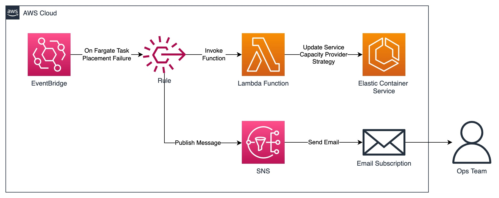

# Amazon ECS Fargate Spot Capacity Failback

## Overview

This repository consists of an [AWS Cloud Development Kit (AWS CDK)](https://aws.amazon.com/cdk/) stack to deploy a failback mechanism specifically for [Amazon Elastic Container Service (ECS)](https://aws.amazon.com/ecs/) services that is using `FARGATE_SPOT` capacity provider. It helps to perform failback in case of event where one or more `FARGATE_SPOT` tasks can't be placed due to the unavailability of [AWS Fargate](https://aws.amazon.com/fargate/) Spot capacity.

## Architecture



The solution creates a rule that will listen to the events published by the [Amazon EventBridge](https://aws.amazon.com/eventbridge/) with the following event pattern. A single deployment is able to to handle the failback across all ECS services in the account where it is deployed.

```
{
  source: [ 'aws.ecs' ],
  detailType: [ 'ECS Service Action' ],
  detail: {
    eventName: [
      'SERVICE_TASK_PLACEMENT_FAILURE'
    ],
    reason: [
      'RESOURCE:FARGATE'
    ]
  }
}
```

Once the rule has been triggered, an [AWS Lambda](https://aws.amazon.com/lambda/) function will be invoked to update the capacity provider strategy of the affected ECS service to use only standard FARGATE capacity provider.

## Deployment

### Prerequisites

1. Install and configure AWS CLI with your IAM user: https://aws.amazon.com/cli/
2. Install CDK: https://docs.aws.amazon.com/cdk/v2/guide/getting_started.html#getting_started_install
3. Pull the source code into your machine

### Deployment Steps

1. Open the file in `cdk.json` and configure `app-config/emailAddress` with your preferred email address to receive the email notifications for the events
2. Run `npm install` to install dependencies
3. Run `cdk bootstrap` to bootstrap CDK toolkit (you only need to perform this once)
4. Run `cdk deploy` to deploy the CDK stack

## Testing

To simulate the scenario where a Fargate task cannot be placed due to unavailability of FARGATE_SPOT capacity, you can set your task definition to use ARM CPU architecture.

## Cleanup

You can run `cdk destroy` to delete the CDK stack
